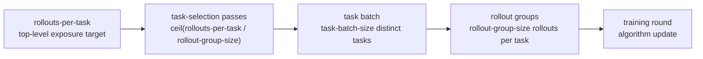
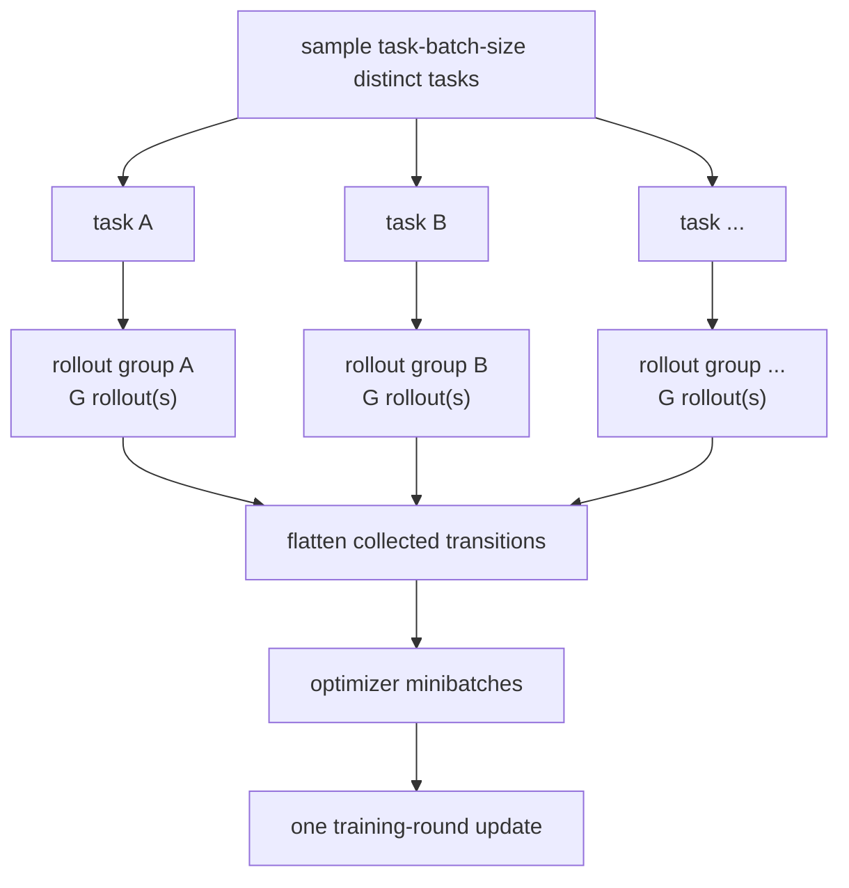
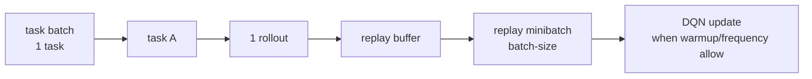
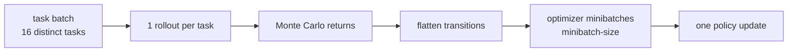
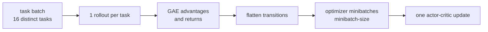
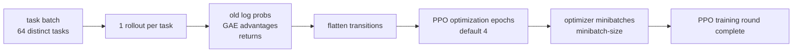
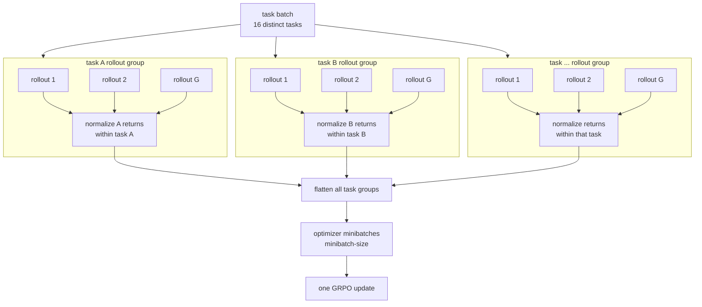

# Rollout Budget Terms

This project separates training budget from training-round shape. The command
line terms are:

- `--rollouts-per-task`: top-level rollout exposure target for each selected
  training task.
- `--task-batch-size`: number of distinct tasks sampled for one training round.
- `--rollout-group-size`: number of rollout attempts generated for each
  selected task in that task batch.

The old flags remain accepted aliases:

- `--dataset-epochs` maps to `--rollouts-per-task`.
- `--rollout-episodes` maps to `--task-batch-size`.
- `--group-size` maps to `--rollout-group-size`.

## Visual Overview

The three CLI knobs form a nested training shape:



One training round looks like this:



The main difference between agents is where learning happens after collection:

```text
dqn        task -> rollout -> replay buffer -> replay minibatches
reinforce  task batch -> one rollout per task -> returns -> policy update
a2c        task batch -> one rollout per task -> GAE/returns -> actor-critic update
ppo        task batch -> one rollout per task -> GAE/returns -> repeated PPO epochs
grpo       task batch -> rollout group per task -> per-task relative advantages -> GRPO update
```

## Core Terms

Task
: One maze navigation problem: a layout plus a start cell and goal cell.

Rollout
: One episode attempt on a task, ending when the agent reaches the goal or hits
  the step limit.

Rollouts per task
: The top-level budget requested by `--rollouts-per-task`. For single-rollout
  agents this is exact. For grouped agents, the internal task-selection count is
  rounded up so every selected task can produce complete rollout groups:

```text
task_selection_passes = ceil(rollouts_per_task / rollout_group_size)
actual_rollouts_per_task = task_selection_passes * rollout_group_size
```

Task-selection pass
: One pass in which each selected training task is sampled once by the
  hierarchical task sampler. This is the internal continuation of the previous
  `dataset_epoch` concept, and metrics still store it in the `epoch` /
  `dataset_epoch` fields for compatibility.

Task batch
: The distinct tasks sampled for one training round:

```text
task_batch = sample task_batch_size distinct tasks
```

Within a task-selection pass, the sampler does not repeat a task. A batch can
span from the end of one pass into the start of the next pass.

Rollout group
: The rollouts generated for one selected task:

```text
rollout_group = run rollout_group_size rollouts on one task
```

Training round
: One collect-and-optimize cycle:

```text
sample task_batch_size tasks
for each task:
  run rollout_group_size rollouts
flatten the collected transitions as needed
perform the algorithm's update
```

Optimization minibatch
: The transition-level minibatches used inside neural optimizer updates. This is
controlled separately by `--minibatch-size` for policy-gradient agents and
`--batch-size` for DQN replay sampling.

## Defaults

```text
algorithm   task_batch_size   rollout_group_size
dqn         1                 1
reinforce   16                1
a2c         16                1
ppo         64                1
grpo        16                8
```

The tuner searches these training-loop dimensions as follows:

```text
algorithm   task_batch_size search   rollout_group_size search
dqn         [1]                      [1]
reinforce   [8, 16, 32]              [1]
a2c         [8, 16, 32]              [1]
ppo         [32, 64, 128]            [1]
grpo        [8, 16, 32]              [4, 8, 16]
```

## DQN

DQN collects one selected task and one rollout per training round by default.
The episode writes transitions into replay memory, and the agent samples replay
minibatches according to its replay settings.



Budget behavior with `--rollouts-per-task 200`:

```text
rollout_group_size = 1
task_selection_passes = 200
actual_rollouts_per_task = 200
```

## Reinforce

Reinforce collects a batch of distinct tasks, runs one rollout per task, computes
Monte Carlo returns for each rollout, flattens the transitions, then performs one
policy update over optimizer minibatches.



Budget behavior with `--rollouts-per-task 200`:

```text
rollout_group_size = 1
task_selection_passes = 200
actual_rollouts_per_task = 200
```

## A2C

A2C uses the same task-batch shape as Reinforce by default. It runs one rollout
per selected task, computes advantages and returns while each trajectory is
intact, then flattens transitions for one actor-critic update.



Budget behavior with `--rollouts-per-task 200`:

```text
rollout_group_size = 1
task_selection_passes = 200
actual_rollouts_per_task = 200
```

## PPO

PPO collects a larger task batch by default. It runs one rollout per selected
task, computes old log probabilities, advantages, and returns, then performs
multiple PPO optimization epochs over minibatches from the flattened transition
pool.



Budget behavior with `--rollouts-per-task 200`:

```text
rollout_group_size = 1
task_selection_passes = 200
actual_rollouts_per_task = 200
```

## GRPO

GRPO uses both layers. It samples a batch of distinct tasks, runs a rollout group
for each selected task, computes group-relative advantages separately inside
each task's rollout group, then flattens all collected transitions into one
optimizer update.



The group-relative normalization is per task, not across the whole flattened
batch:

```text
advantage(task A rollout i) =
  (return(task A rollout i) - mean(returns for task A group))
  / std(returns for task A group)
```

This avoids comparing raw returns across unrelated maze tasks with different
layouts, path lengths, and difficulty.

Budget behavior with `--rollouts-per-task 200 --rollout-group-size 8`:

```text
rollout_group_size = 8
task_selection_passes = ceil(200 / 8) = 25
actual_rollouts_per_task = 25 * 8 = 200
```

Budget behavior with `--rollouts-per-task 200 --rollout-group-size 16`:

```text
rollout_group_size = 16
task_selection_passes = ceil(200 / 16) = 13
actual_rollouts_per_task = 13 * 16 = 208
```

## Reading Progress

Training and validation progress is reported against task-selection passes.
TensorBoard still includes rollout-level, transition-level, dataset-epoch-level,
training-round-level, and optimization-epoch-level views. In the current metrics
schema, `dataset_epoch` means the internal task-selection pass.

When a grouped agent uses a larger `rollout_group_size`, it has fewer
task-selection passes for the same `rollouts_per_task` target. That is expected:
each selected task contributes several rollout attempts at once.
